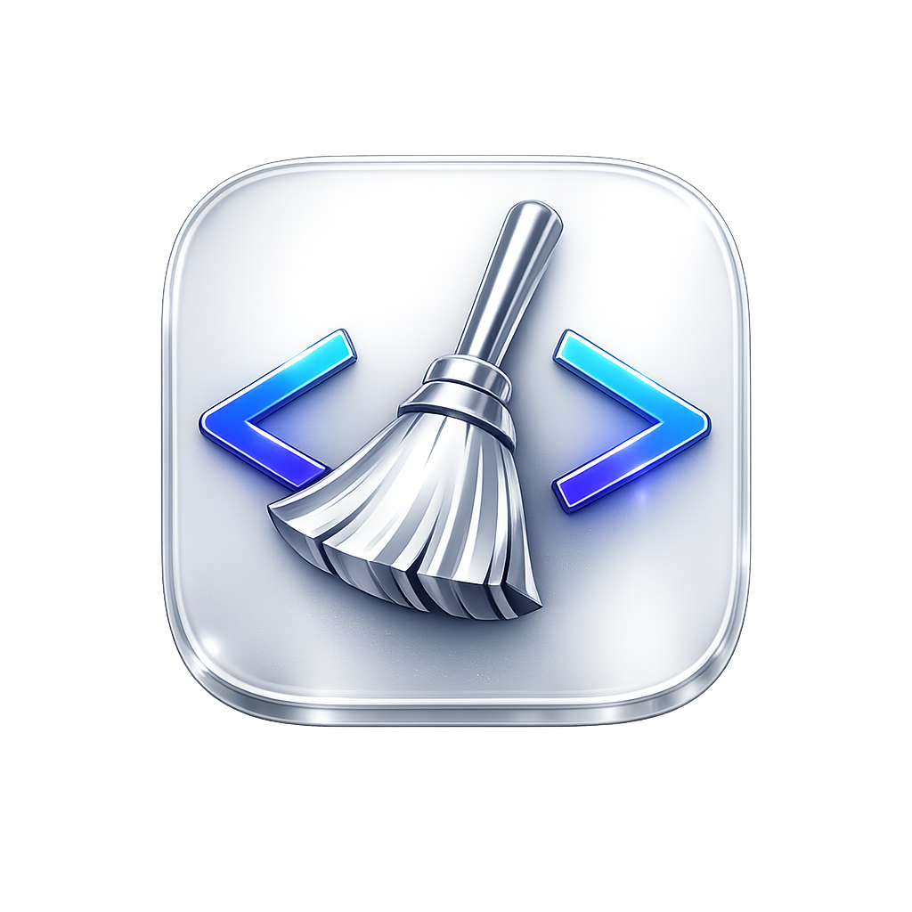
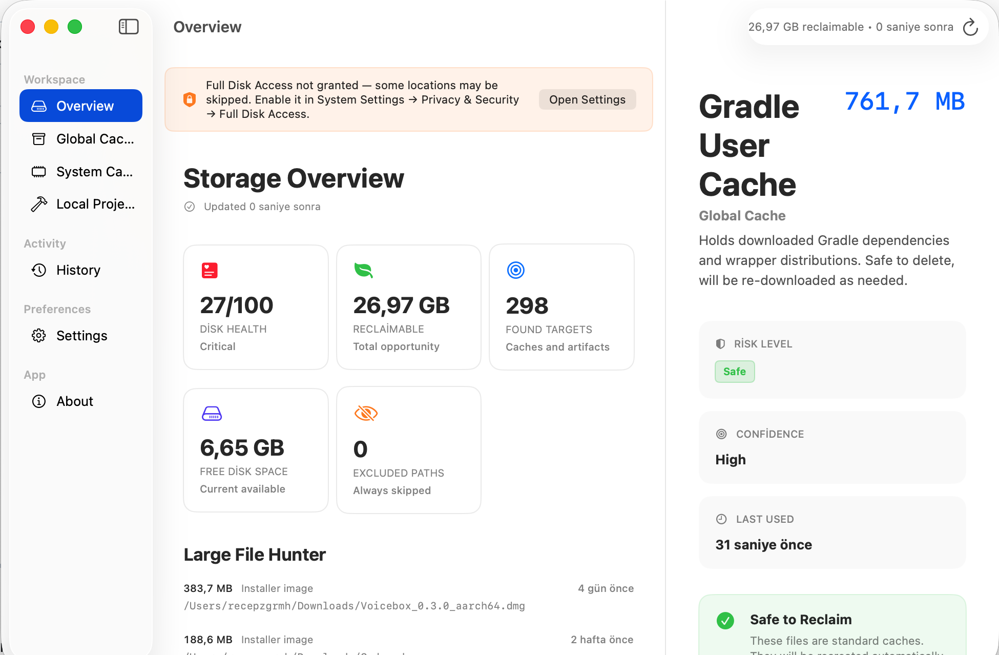
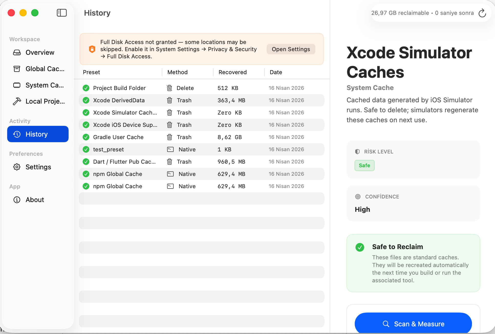
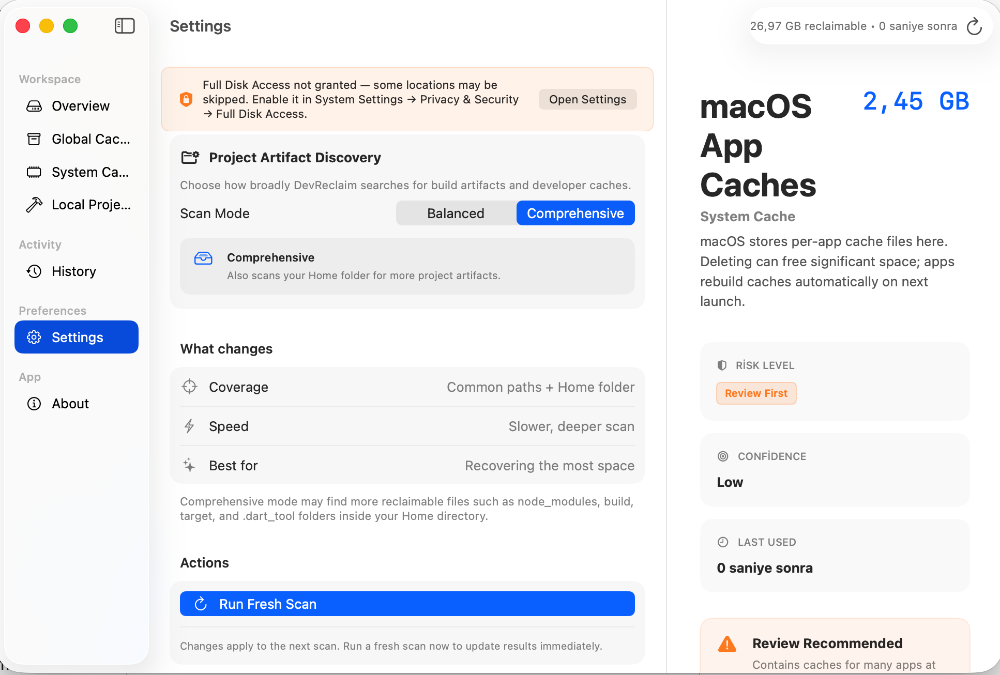
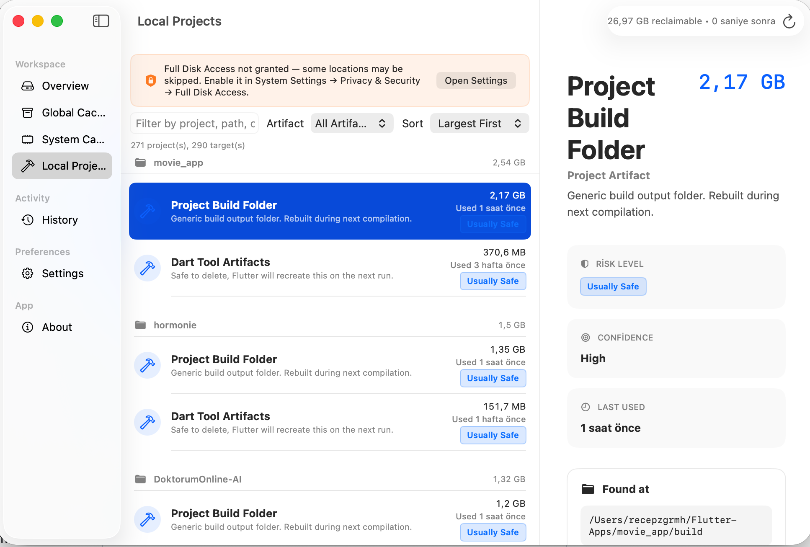

<div>
<h3>DevReclaim</h3>
<p><strong>Native macOS cleaner for developers.</strong><br/>
Clean Xcode DerivedData, npm/yarn/pnpm caches, CocoaPods leftovers, Gradle artifacts and other build junk safely.</p>
<a href="https://github.com/recepzgrmh/Mac-Developer-Cleaner/releases/latest"></a>
</div>

<br/><br/>

<div align="center">
<a href="https://github.com/recepzgrmh/Mac-Developer-Cleaner/releases"></a>
<a href="https://github.com/recepzgrmh/Mac-Developer-Cleaner/releases/latest"></a>
<a href="https://github.com/recepzgrmh/Mac-Developer-Cleaner"></a>
<a href="https://swift.org"></a>

<br/>
<br/>

<br/>

</div>

<hr>

> [!IMPORTANT]
> DevReclaim is designed for developer environments and follows a safety-first cleanup approach. Review scan results before cleanup, especially on shared machines.

## Download

Go to [Releases](https://github.com/recepzgrmh/Mac-Developer-Cleaner/releases) and download the latest `.dmg`.

- Latest stable release: [v1.1.2](https://github.com/recepzgrmh/Mac-Developer-Cleaner/releases/tag/v1.1.2)
- Current DMG: `DevReclaim_v1.1.2.dmg`

## Major Features

- Clean developer-specific storage bloat on macOS
- Native SwiftUI experience with lightweight footprint
- Preset-based scanning for common toolchains
- History/audit view of cleanup actions
- Risk-aware execution flow (no blind destructive behavior)
- Built for workflows around Xcode, Node.js, Flutter, CocoaPods, Gradle and similar stacks

## What It Cleans

- **Xcode:** DerivedData, build logs, archives (based on selected targets)
- **Node ecosystem:** npm cache, Yarn cache, pnpm artifacts
- **Apple/mobile:** CocoaPods leftovers, Flutter/Dart build cache
- **Android/JVM:** Gradle cache/build residues
- **General:** stale development temporary artifacts

## Screenshots (Optional Gallery)

<div align="center">




</div>

> New screenshots are located in `assets/screenshots/`.

## How to Install and Use

1. Download the latest `.dmg` from [Releases](https://github.com/recepzgrmh/Mac-Developer-Cleaner/releases)
2. Drag `DevReclaim.app` to the `Applications` folder
3. Launch the app and start a scan
4. Review results and reclaim space safely

## macOS Compatibility

| DevReclaim version | macOS version |
| ------------------ | ------------- |
| v1.1.x             | macOS 14+     |

## Build From Source

### Requirements

- macOS 14+
- Xcode 15+
- Swift 5.9+

### Build Steps

```sh
git clone https://github.com/recepzgrmh/Mac-Developer-Cleaner.git
cd Mac-Developer-Cleaner
open Package.swift
```

Then build/run with `Cmd + R` in Xcode.

### Package a DMG

```sh
bash scripts/package.sh 1.1.2
```

Output path:

- `dist/DevReclaim_v1.1.2.dmg`

## Project Structure

- `DevReclaim/Core/Engine/` - scanner and cleanup orchestration
- `DevReclaim/Core/Executors/` - cleanup execution backends
- `DevReclaim/UI/ViewModels/` - app state and interaction logic
- `DevReclaim/UI/Views/` - SwiftUI screens and reusable components
- `DevReclaim/Models/` - domain models

## Contributing

Contributions are welcome. Open an issue or PR for:

- New cleanup presets
- Scanner improvements
- UX/performance improvements
- Packaging/release automation

## License

MIT.
